# ERD Diagram - BookStore Database

## Entity Relationship Diagram

```mermaid
erDiagram
    %% ==================== USER MANAGEMENT ====================
    users {
        bigint id PK
        varchar email UK
        varchar phone UK
        varchar password_hash
        varchar full_name
        text default_address
        bigint tier_id FK
        decimal total_spent
        int reward_points
        enum status
        datetime created_at
    }

    admins {
        bigint id PK
        varchar email UK
        varchar password_hash
        varchar full_name
        enum role
        json permissions
        boolean is_active
        datetime created_at
    }

    otp_codes {
        bigint id PK
        bigint user_id FK
        varchar code
        enum type
        datetime expires_at
        boolean is_used
        datetime created_at
    }

    customer_tiers {
        bigint id PK
        varchar name UK
        decimal min_spent
        int discount_percent
        text benefits
        datetime created_at
    }

    %% ==================== PRODUCT CATALOG ====================
    categories {
        bigint id PK
        varchar name
        varchar slug UK
        bigint parent_id FK
        int level
        text description
        varchar image_url
        int sort_order
        boolean is_active
        datetime created_at
    }

    authors {
        bigint id PK
        varchar name
        varchar slug UK
        text biography
        varchar image_url
        datetime created_at
    }

    publishers {
        bigint id PK
        varchar name UK
        varchar slug UK
        text address
        varchar phone
        varchar email
        datetime created_at
    }

    books {
        bigint id PK
        bigint category_id FK
        bigint publisher_id FK
        varchar title
        varchar slug UK
        varchar isbn UK
        int publication_year
        int pages
        varchar dimensions
        int weight_grams
        enum cover_type
        text description
        decimal base_price
        decimal avg_rating
        int review_count
        int sold_count
        boolean is_active
        datetime created_at
    }

    book_authors {
        bigint id PK
        bigint book_id FK
        bigint author_id FK
        boolean is_primary
    }

    book_variants {
        bigint id PK
        bigint book_id FK
        bigint publisher_id FK
        varchar sku UK
        enum cover_type
        varchar edition
        decimal price
        decimal compare_at_price
        boolean is_active
        datetime created_at
    }

    book_images {
        bigint id PK
        bigint book_id FK
        varchar image_url
        boolean is_primary
        int sort_order
        datetime created_at
    }

    price_history {
        bigint id PK
        bigint variant_id FK
        decimal old_price
        decimal new_price
        bigint changed_by FK
        varchar reason
        datetime created_at
    }

    %% ==================== INVENTORY ====================
    inventory {
        bigint id PK
        bigint variant_id FK
        int quantity
        int reserved_quantity
        int min_stock_level
        datetime last_restocked_at
        datetime updated_at
    }

    inventory_history {
        bigint id PK
        bigint variant_id FK
        enum type
        int quantity_change
        int quantity_after
        varchar reason
        varchar reference_code
        bigint created_by FK
        datetime created_at
    }

    %% ==================== CART & WISHLIST ====================
    carts {
        bigint id PK
        bigint user_id FK
        bigint variant_id FK
        int quantity
        datetime created_at
        datetime updated_at
    }

    wishlists {
        bigint id PK
        bigint user_id FK
        bigint book_id FK
        datetime created_at
    }

    %% ==================== ORDERS ====================
    orders {
        bigint id PK
        varchar order_code UK
        bigint user_id FK
        bigint voucher_id FK
        bigint carrier_id FK
        decimal subtotal
        decimal shipping_fee
        decimal discount_amount
        decimal points_used
        decimal points_discount
        decimal total_amount
        enum payment_method
        enum payment_status
        enum status
        text shipping_address
        varchar recipient_name
        varchar recipient_phone
        varchar tracking_number
        text note
        datetime created_at
        datetime updated_at
    }

    order_items {
        bigint id PK
        bigint order_id FK
        bigint variant_id FK
        bigint promotion_id FK
        int quantity
        decimal unit_price
        decimal discount_amount
        decimal subtotal
        datetime created_at
    }

    order_status_history {
        bigint id PK
        bigint order_id FK
        enum old_status
        enum new_status
        text note
        bigint changed_by FK
        datetime created_at
    }

    refunds {
        bigint id PK
        bigint order_id FK
        bigint order_item_id FK
        enum type
        enum reason
        text description
        text images
        decimal refund_amount
        enum status
        text admin_note
        bigint processed_by FK
        datetime created_at
        datetime processed_at
    }

    %% ==================== PAYMENTS ====================
    payments {
        bigint id PK
        bigint order_id FK
        enum method
        varchar transaction_id UK
        decimal amount
        enum status
        text gateway_response
        int installment_months
        varchar installment_bank
        datetime created_at
        datetime updated_at
    }

    %% ==================== PROMOTIONS ====================
    flash_sales {
        bigint id PK
        varchar name
        datetime start_time
        datetime end_time
        boolean is_active
        datetime created_at
    }

    flash_sale_items {
        bigint id PK
        bigint flash_sale_id FK
        bigint variant_id FK
        decimal sale_price
        int quantity_limit
        int sold_count
        datetime created_at
    }

    vouchers {
        bigint id PK
        varchar code UK
        varchar name
        text description
        enum discount_type
        decimal discount_value
        decimal max_discount
        decimal min_order_value
        int usage_limit
        int used_count
        int per_user_limit
        datetime start_date
        datetime end_date
        boolean is_active
        datetime created_at
    }

    voucher_usage {
        bigint id PK
        bigint voucher_id FK
        bigint user_id FK
        bigint order_id FK
        decimal discount_amount
        datetime used_at
    }

    promotions {
        bigint id PK
        varchar name
        text description
        enum type
        int discount_percent
        int buy_quantity
        int get_quantity
        int bundle_min_quantity
        int bundle_discount_percent
        datetime start_date
        datetime end_date
        boolean is_active
        datetime created_at
    }

    promotion_books {
        bigint id PK
        bigint promotion_id FK
        bigint book_id FK
        boolean is_gift
        datetime created_at
    }

    %% ==================== REWARDS ====================
    reward_points {
        bigint id PK
        bigint user_id FK
        int points
        enum type
        varchar reference_type
        bigint reference_id
        text description
        datetime expires_at
        datetime created_at
    }

    loyalty_transactions {
        bigint id PK
        bigint user_id FK
        enum transaction_type
        int points_amount
        int points_balance_after
        varchar reference_type
        bigint reference_id
        text description
        datetime created_at
    }

    %% ==================== SHIPPING ====================
    shipping_carriers {
        bigint id PK
        varchar name UK
        varchar code UK
        varchar logo_url
        varchar api_endpoint
        varchar api_key
        boolean is_active
        datetime created_at
    }

    shipping_rates {
        bigint id PK
        bigint carrier_id FK
        varchar province_code
        varchar province_name
        decimal base_fee
        decimal per_kg_fee
        decimal per_500g_fee
        int estimated_days_min
        int estimated_days_max
        boolean is_active
        datetime created_at
    }

    %% ==================== REVIEWS ====================
    reviews {
        bigint id PK
        bigint user_id FK
        bigint book_id FK
        bigint order_item_id FK
        int rating
        text comment
        boolean is_verified
        boolean is_visible
        int helpful_count
        datetime created_at
        datetime updated_at
    }

    review_images {
        bigint id PK
        bigint review_id FK
        varchar image_url
        int sort_order
        datetime created_at
    }

    %% ==================== NOTIFICATIONS ====================
    notifications {
        bigint id PK
        bigint user_id FK
        varchar title
        text content
        enum type
        varchar reference_type
        bigint reference_id
        boolean is_read
        boolean is_email_sent
        datetime created_at
    }

    %% ==================== RECOMMENDATIONS ====================
    user_book_interactions {
        bigint id PK
        bigint user_id FK
        bigint book_id FK
        enum interaction_type
        int interaction_count
        datetime last_interaction_at
        datetime created_at
    }

    %% ==================== RELATIONSHIPS ====================
    users ||--o{ otp_codes : "has"
    users ||--o{ carts : "has"
    users ||--o{ wishlists : "has"
    users ||--o{ orders : "places"
    users ||--o{ reviews : "writes"
    users ||--o{ notifications : "receives"
    users ||--o{ reward_points : "earns"
    users ||--o{ loyalty_transactions : "has"
    users ||--o{ voucher_usage : "uses"
    users ||--o{ user_book_interactions : "interacts"
    customer_tiers ||--o{ users : "has"

    categories ||--o{ categories : "parent_of"
    categories ||--o{ books : "contains"

    publishers ||--o{ books : "publishes"
    publishers ||--o{ book_variants : "publishes"

    authors ||--o{ book_authors : "writes"
    books ||--o{ book_authors : "written_by"

    books ||--o{ book_variants : "has"
    books ||--o{ book_images : "has"
    books ||--o{ wishlists : "in"
    books ||--o{ reviews : "has"
    books ||--o{ promotion_books : "in"
    books ||--o{ user_book_interactions : "has"

    book_variants ||--o{ inventory : "has"
    book_variants ||--o{ inventory_history : "tracks"
    book_variants ||--o{ price_history : "tracks"
    book_variants ||--o{ carts : "in"
    book_variants ||--o{ order_items : "in"
    book_variants ||--o{ flash_sale_items : "in"

    admins ||--o{ price_history : "changes"
    admins ||--o{ inventory_history : "creates"
    admins ||--o{ order_status_history : "updates"
    admins ||--o{ refunds : "processes"

    orders ||--o{ order_items : "contains"
    orders ||--o{ order_status_history : "has"
    orders ||--o{ payments : "has"
    orders ||--o{ refunds : "has"
    orders ||--o{ voucher_usage : "uses"

    order_items ||--o{ refunds : "refunds"
    order_items ||--o{ reviews : "enables"

    vouchers ||--o{ orders : "applied_to"
    vouchers ||--o{ voucher_usage : "tracks"

    shipping_carriers ||--o{ orders : "delivers"
    shipping_carriers ||--o{ shipping_rates : "has"

    flash_sales ||--o{ flash_sale_items : "contains"
    promotions ||--o{ promotion_books : "applies_to"
    promotions ||--o{ order_items : "discounts"

    reviews ||--o{ review_images : "has"
```

## Tổng quan

- **Tổng số bảng**: 26 bảng
- **Naming convention**: snake_case
- **Chuẩn hóa**: 3NF

## Nhóm chức năng

| Nhóm | Số bảng | Bảng |
|------|---------|------|
| User Management | 4 | `users`, `admins`, `otp_codes`, `customer_tiers` |
| Product Catalog | 8 | `categories`, `authors`, `publishers`, `books`, `book_authors`, `book_variants`, `book_images`, `price_history` |
| Inventory | 2 | `inventory`, `inventory_history` |
| Cart & Wishlist | 2 | `carts`, `wishlists` |
| Orders | 4 | `orders`, `order_items`, `order_status_history`, `refunds` |
| Payments | 1 | `payments` |
| Promotions | 6 | `flash_sales`, `flash_sale_items`, `vouchers`, `voucher_usage`, `promotions`, `promotion_books` |
| Rewards | 2 | `reward_points`, `loyalty_transactions` |
| Shipping | 2 | `shipping_carriers`, `shipping_rates` |
| Reviews | 2 | `reviews`, `review_images` |
| Notifications | 1 | `notifications` |
| Recommendations | 1 | `user_book_interactions` |
